## How to make $5,000 from online sportsbooks in one day

With online sports gambling becoming legal in so many states, a huge number of online sportsbooks are being created, and all of them are fighting for your business. Think back to the days when Uber and Lyft were competing by giving out free rides, or food delivery apps were giving out free meals.  The same thing is going on today with online sportsbooks, except rather than rides or food, **they are giving you cash!**  By simply taking advantage of these sportsbook promotions, **I have made over $7,000 in the past year**. I will show you how I was able to do it, and provide you a roadmap to do the same.

### Contents
[Sports Betting 101](#sports-betting-101)  
[Overview of Sportsbook Promos](#overview-of-sportsbook-promos) 
[The Best New User Promos: ~$2,000 in risk-free cash](#the-best-new-user-promos) 
[How To Guarantee Yourself Winnings From Risk Free Bets](#how-to-guarantee-yourself-winnings-from-risk-free-bets)  
[Keep The Earnings Going: Sportsbook Reviews and Rankings](#sportsbook-reviews-and-rankings)

### Sports Betting 101
For those new to sports betting, it can be a bit intimidating, but once you learn a few basics, it is actually quite simple. This section will first help you understand odds, or the risk/reward associated with a bet. Then we will cover a few of the more common types of bets.

#### Understanding Odds
Most bets will not return the bet (stake) amount 1-to-1. Odds tell you how much potential winnings you can make on a particular bet, so when considering whether or not to place a bet, the odds are an important factor.   
Odds are usually presented as either 
<ul>
  <li>how many dollars you would win off of a $100 bet.  This is any odds that are shown with a "+" (e.g. "+150")</li>
  <li>how much you would have to bet to win $100. This is any odds that are shown with a "-" (e.g. "-110")</li> 
</ul>
Generally, <i>positive</i> odds (e.g. "+120") means you will win more than your stake, and <i>negative</i> odds (e.g. -120") means you will win less than your stake if your bet wins. +100 means your winnings will be equal to your stake. 

The blue text in the image below are the odds associated with different types of bets. 
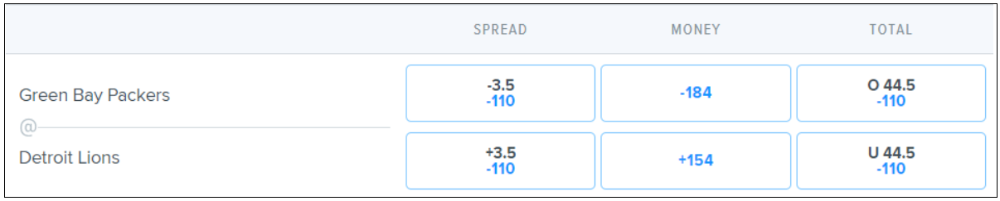
In the above:
<ul>
  <li>-110 means that if you bet $110, you will win $100 (plus the $110 returned that you bet)</li>
  <li>-184 means that if you bet $184, you will win $100 (plus the $184 returned that you bet)</li>
  <li>+154 means that if you bet $100, you will win $154 (plus the $100 returned that you bet)</li>
</ul>

<i>The table below gives the net winnings off of a $100 bet at various odds. As you can see if the odds are positive, the amount of winnings on a $100 bet is equal to the positive odds. If the odds are negative, the winnings on $100 bet is calculated by (100/X) x 100, with X being the negative odds number:</i> 
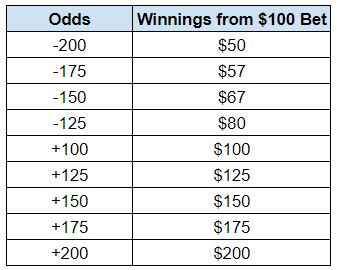

#### Straight Bets
A straight bet is a bet on the outcome of a single event, such as who will win a match.  This is the most common type of bet that people make.  The image below shows the three main types of straight bets that can be made: (i) spread, (ii) moneyline, and (iii) total (over/under).  This image is very similar to what the interface will look like on any sportsbook, with each team being a row, and the spread, moneyline, and total score (over/under) being their own columns

##### Spread Bets
Betting the spread of a match means you are betting on how many points by which a team would win or lose.  In the above example, in the spread column, the black text (-3.5 and +3.5) tells you the <i>spread</i>.  This means that if you picked the Packers to beat the spread, they would have to win <i>by more than</i> 3.5 points in order for you to cover (win) your bet.  Conversely, if you bet on the Lions to cover the spread, as long as the Lions win outright, or lose by fewer than 3.5 points, you would win your bet.  So if you were to make a $100 bet on the Packers to cover -3 at the -110 odds shown above, and the Packers won 21-14, then you would win your bet because the packers won by more than 3 points. This would return to you the $100 initially staked plus $100*100/110 = $91 in winnings.

In the example shown above, the spread includes a half-point so there could be no tie. If the spread were, for example -3 and +3, and the Packers won by exactly 3 points, then this would be a tie or <i>push</i>. When there is a push, your stake would be returned to you, but there are no winnings.

You'll notice the odds on this spread are -110 when betting on either team to cover. This is usually the case with spread bets, as the spread is meant to make either team <i>covering</i> more or less equally likely, and the Sportsbook usually sets the odds on either side so that they take a cut of each bet.

##### Moneyline Bets
A moneyline bet means you are picking a team to win outright.  Again in the above example, you can pick the Packers to win outright or the Lions to win outright.  Notice in this bet that the odds are significantly different than in the spread bet.  This makes sense, as we see that the Packers are favored by 3 points (based on the spread). Therefore, picking the Packers to win outright is less risky than picking the Lions to win outright and so the potential payout of winning a moneyline bet on the Lions is higher (+154 vs. -184).This means a $100 bet for the Packers to win would return the $100 plus $54 in winnings if the Packers won. A $100 bet for the Lions to win would return your $100 staked plus $154 in winnings, if the Lions won.

##### Total (Over/Under) Bets
Over/Under bets are different from spread or moneyline bets in that rather than picking a particular team to win or cover the spread, you are betting on the total score of the match. The black text in the above example tells you the line on the total score, and you can bet whether the total will be higher or lower than that. In this example we see the total line is set at 44.5.  The top row lets you choose the over (indicated by the "o 44.5"), and the bottom row lets you choose the under (indicated by the "u 44.5").

Notice again that similar to the spread bet, we see odds of -110 if you pick the over or if you pick the under. This is again because the total line is supposed to be set so that hitting the over or under are (generally) equally likely.

#### Prop Bets
Prop bets are different from straight bets in that they allow you to bet on specific events occurring within a match. Prop bets are generally structured the same as either moneyline bets or over/unders. Some examples of prop bets are called out below for now. We will get into prop bets in much more detail in future sections.
<ul>
  <li>Player Prop:  Bet on a player to record over/under 5 catches</li>
  <li>Player Prop: Bet on whether or not a player will score</li>
  <li>Game Prop: Bet on the longest passing touchdown to be over/under a certain number of yards</li>
  <li>etc.</li>
</ul>

#### Parlays
A parlay is just a bet that combines 2 or more bets of any of the above types. If you place a 2-bet parlay, you are betting you will win Bet #1 AND Bet #2. If either of these bets loses in a parlay, you lose the entire bet. Because of this, typically parlay's have higher payouts than if you were to just make each bet independently.

### Overview of Sportsbook Promos
Many Sportbook Platforms offer promotional deals to entice participants to their sites. These promotions vary in terms and may change from time to time, and there are many different types of promos that sportsbooks offer. This section will give a quick intro to the different types of promos.  The sections that follow will detail specific promos offered by different sportsboooks, and how best to capitalize on them.

#### New User Promos
New user promos are offered by almost all sportsbooks as an incentive to sign up for their book & download the app. These are one-time promotions offered to users when they first sign up for a specific sportsbook, and usually take one of three forms:
<ul>
  <li><b>Risk Free First Bet:</b> Probably the best new user promo if you know how to take advantage of it. Risk free first bets generally refund the first bet that you make with a sportsbook, up to a certain limit, if you lose. See [How to Guarantee Yourself Winnings From Risk Free Bets](#how-to-guarantee-yourself-winnings-from-risk-free-bets) section below for how best to use these promos</li>
  <li><b>Deposit Match Bonus:</b> Some books will match your first deposit up to a certain limit. Most books will have a certain playthrough requirement for bonus funds that are matched, so make sure to check to understand what that requirement is.  For example, a book could match your first $1,000 deposited, but require you to bet 3x through ($3,000) before being able to withdraw those bonus funds (your cash deposit however is always withdrawable)</li>
  <li><b>Enhanced Odds Bonus:</b> Some books will offer enhanced odds for your first bet after signing up. Draftkings does this commonly. This could look like "Bet $5 to win $200". </li>
</ul>

In the [The Best New User Promos](#the-best-new-user-promos) section that follows, you can see a list of some of the best new user promos, and advice on the best way to capitalize on them. Make sure to reference the details in the [How to Guarantee Yourself Winnings From Risk Free Bets](#how-to-guarantee-yourself-winnings-from-risk-free-bets) for more detailed advice.  

#### Promos Regularly Available
In addition to new user promos, most books offer a wide range of other promotions that can be taken advantage of to give yoursefl an edge when betting.  An overview of these types of promos is provided in this section, but refer to the [Sportsbook Reviews and Rankings](#sportsbook-reviews-and-rankings) section for details on the common types of promos offered at different books.
<ul>
  <li><b>Odds Boosts:</b> Most books offer odds boosts or enhanced odds on certain bets. This can take the form of an X% odds boost token that can be used on a bet of your choosing, or can be higher odds offered for a specific bet. This is very common on books such as Draftkings, BoxBet, Caesars, or BetRivers</li>
  <li><b>Parlay Insurance:</b> Many books will offer some form of parlay insurance, so if you make a parlay bet, and lose, you may be able to re-coup the staked amount in free bet credits if certain conditions are met. These condidtions will vary by book. These types of promos are common on books like Fanduel and BetMGM</li>
  <li><b>Additional Winnings:</b> This is less common than the above two, but you will sometimes see offers where if you make a certain bet of at least $X, then you will recieve additional winnings based on a specifed prop bet. An example of this would be <i>Bet $100 on team A to cover the spread, and win $10 for every touchdown scored by that team</i>. These types of promotions are commonnly offered by Caesars.</li>
</ul>

### The Best New User Promos

The easiest way to make money quickly is by taking advantage of the new user promos that many books are offering.  Below I have detailed a list of my favorite sportsbooks that regularly offer promotions and sign-up bonuses, ordered from most to least valuable. See [How To Guarantee Yourself Winnings From Risk Free Bets](#how-to-guarantee-yourself-winnings-from-risk-free-bets) section that follows for more details on how to use these sign-up bonuses to net yourself **~$5,000 in cash**.

<i>Note - you should to check the terms and conditions for these promos on the each sport book’s website for yourself before implementing any of these strategies, too ensure you have the most up-to-date information</i>

<table width ="100%">
  <col style="width:20%">
  <col style="width:40%">
  <col style="width:40%">
  <thead>
  <tr>
    <th>Promo</th>
    <th>Details</th>
    <th>Advice</th>
  </tr>
  </thead>
  <tbody>
    
  <tr valign = "Middle">
    <td align = "Center">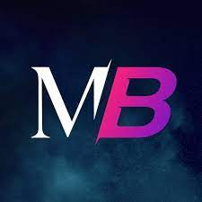 <b>MaximBet</b> 
       <a href="https://maximbet.com/promotions/welcome-to-2022">Deposit match up to $2,000</a> 
      <i>Until Jan. 31st, 2022</i></td>
    <td align = "Left">
      <ol style = "padding-left:10px">
        <li>Sign up for MaximBet <a href="https://co.maximbet.com/sportsbook/"><u>here</u></a> and make your first deposit of $2,000</li>
        <li>MaximBet will match your deposit dollar for dollar up to $2,000, and give you an additional $22</li>
        <li>Deposit match funds only have 1x playthrough requirement, but do expire within 7 days</li>
      </ol>
    </td>
    <td align = "Left">
      <ul style = "padding-left:10px">
        <li>This is basically a $2,000 risk-free bet on a book that credits free bets back. By far the best promo I have seen</li>
        <li>You will need to bet a total of $4,000 before withdrawing any funds to take full advantage</li>
        <li>Find a friend and take opposite sides of 8 $500 bets with half-point (e.g. -5.5) lines at -110 odds on each side to <b>guarantee $1,820</b> each</li>
        <li>$1,820 Net + $2,000 deposit back = ($4,000 total deposit + $4,000 total match - $4,000 lost betting + ($4,000*100/110 = $3,636 bet winnings)) / 2 (each bettor)</li>
        <li>Free bet tokens expire in 7 days, be sure to take advantage of this</li>
      </ul>
    </td>
  </tr>        
    
  <tr valign = "Middle">
    <td align = "Center">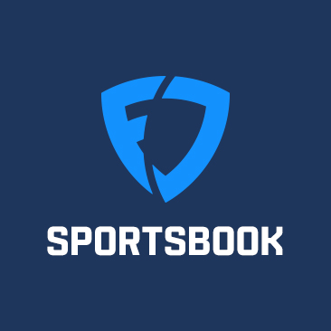<b>Fanduel</b> 
       <a href="https://www.fanduel.com/sportsbook-search?utm_source=google&utm_medium=cpc&utm_campaign=brand&gclid=Cj0KCQiAieWOBhCYARIsANcOw0yAWOOQ4fHaEtIBemFs1lEer1ruFtqC0jItUMs7teTIWgj110yV_WgaAsegEALw_wcB">$1,000 "Risk Free" Bet</a> 
      <i>Until Jan. 31st, 2022</i></td>
    <td align = "Left">
      <ol style = "padding-left:10px">
        <li>Sign up for Fanduel Sportsbook at <a href="https://account.nj.sportsbook.fanduel.com/join#DRAF=Charles_1170624"><u>this link</u></a></li>
        <li>Make your first deposit of $1,000</li>
        <li>If your first bet loses, you will be refunded up to $1,000 in site credit</li>
      </ol>
    </td>
    <td align = "Left">
      <ul style = "padding-left:10px">
        <li>Use <a href="https://account.nj.sportsbook.fanduel.com/join#DRAF=Charles_1170624"><u>this link</u>,</a> for an extra $50 credit</li>
        <li>Make sure your first bet is $1,000</li>
        <li>On Fanduel, when site credit bets are won, you receive the staked site credit as well (a $1,000 bet made on credit with +100 odds returns $2,000 total). Use strategy #1 mentioned in section below (<b>$410 guaranteed</b>)</li>
      </ul>
    </td>
  </tr>
    
  <tr valign = "Middle">
    <td align = "Center">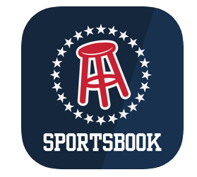<b>Barstool</b> 
       <a href="https://www.barstoolsportsbook.com/promotions/new-player-bonus">$1,000 "Risk Free" Bet</a> 
      <i>Until Dec. 31st, 2022</i></td>
    <td align = "Left">
      <ol style = "padding-left:10px">
        <li>Sign up for Barstool Sportsbook at <a href="https://www.barstoolsportsbook.com/"><u>this link</u></a></li>
        <li>Make your first deposit up to $1,000</li>
        <li>If your first bet loses, you will be refunded up to $1,000 in site credit</li>
      </ol>
    </td>
    <td align = "Left">
      <ul style = "padding-left:10px">
        <li>Make sure your first bet is $1,000</li>
        <li>On Barstool, when site credit bets are won, you receive the staked site credit as well. Use strategy #1 mentioned in section below (<b>$410 guaranteed</b>)</li>
      </ul>
    </td>
  </tr>    
    
  <tr valign = "Middle">
    <td align = "Center"> <b>Caesars</b> 
       <a href="https://www.williamhill.com/us/co/bet/promos/bet-match-1001">$1,000 "Risk Free" Bet</a> 
      <i>Until Jan. 31st, 2022</i></td>
    <td align = "Left">
      <ol style = "padding-left:10px">
        <li>Sign up for a new Caesars Sportsbook account <a href="https://www.caesars.com/sportsbook-and-casino/referral?AR=CO9524121332&pid=czrs&utm_source=czrs&utm_medium=creferral&c=creferral&utm_campaign=CO9524121332"><u>here</u></a> using promo code CZR1</li>
        <li>Deposit funds and place your first wager up to $1,001. Note, odds must be -200 or higher</li>
        <li>Once your bet settles, you will receive a free bet of the same value whether you won or lost</li>
      </ol>
    </td>
    <td align = "Left">
      <ul style = "padding-left:10px">
        <li>Use <a href="https://www.caesars.com/sportsbook-and-casino/referral?AR=CO9524121332&pid=czrs&utm_source=czrs&utm_medium=creferral&c=creferral&utm_campaign=CO9524121332"><u>this link</u></a> for an extra $100 free bet</li>
        <li>On Caesars, when "free bets" are won, you receive the winnings, but not the staked "free bet" (a $1,000 free bet with +100 odds returns $1,000 total)</li>
        <li>Beccause you will both receive a free bet (win or lose), use strategy #1 in section below, each using your free bet for bet #2(<b>$410 guaranteed</b>)</li>
        <li>This is still a great intro offer because you receive the credit regardless of whether your bet wins or loses</li>
      </ul>
    </td>
  </tr>

        
  <tr valign = "Middle">
    <td align = "Center">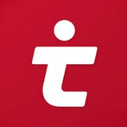 <b>Tipico Sportsbook</b> 
       <a href="https://www.tipico.com/us/co-register-sports-112021?bonusCode=RISKFREE750&gclid=Cj0KCQiAuP-OBhDqARIsAD4XHpdQrfG0fHdlXAXyU3FvJmrDISvZvC4M7LJwMeTFGROx3_B60cnzr10aAnjoEALw_wcB">Risk free bet up to $750</a></td>
    <td align = "Left">
      <ol style = "padding-left:10px">
        <li>Sign up for Tipico <a href="https://www.tipico.com/us/co-register-sports-112021?bonusCode=RISKFREE750&gclid=Cj0KCQiAuP-OBhDqARIsAD4XHpdQrfG0fHdlXAXyU3FvJmrDISvZvC4M7LJwMeTFGROx3_B60cnzr10aAnjoEALw_wcB"><u>here</u></a> and make your first deposit of $750</li>
        <li>Download the Tipico App</li>
        <li>Make your first bet. if it loses, you will be refunded the staked amount, up to $750.</li>
      </ol>
    </td>
    <td align = "Left">
      <ul style = "padding-left:10px">
        <li>Make sure to apply your free bet in the betslip, before submitting your first bet.</li>
        <li> ensure all bets are made and will settle within 30 days of signing up or bonus funds will expire</li>
        <li>Bonus funds have a 1x playthrough requirement, so free bets do get awarded back as cash. Use Strategy #1 adjusted for $750 in section below to <b> guarantee $307.</li>
      </ul>
    </td>
  </tr>              

            
  <tr valign = "Middle">
    <td align = "Center">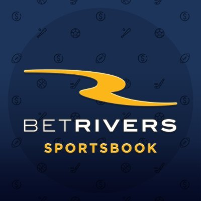 <b>BetRivers</b> 
       <a href="https://co.betrivers.com/?page=promotions&promotion=deposit-match">Deposit match up to $250</a></td>
    <td align = "Left">
      <ol style = "padding-left:10px">
        <li>Sign up for BetRivers <a href="https://co.betrivers.com/?page=signup"><u>here</u></a> and make your first deposit of $250 using code 250MATCH</li>
        <li>BetRivers will match your deposit dollar for dollar up to $250</li>
        <li>Deposit match funds only have 1x playthrough requirement, but do expire within 30 days</li>
      </ol>
    </td>
    <td align = "Left">
      <ul style = "padding-left:10px">
        <li>This is basically a $250 risk-free bet on a book that credits free bets back.</li>
        <li>You will need to bet a total of $500 before withdrawing any funds to take full advantage</li>
        <li>Find a friend and take opposite sides of a $500 bet with a half-point (e.g. -5.5) spread at -110 odds on each side to <b>guarantee $227</b> each</li>
        <li>$227 net + $250 deposit back = ($500 total deposit + $500 total match - $500 lost betting + ($500*100/110 = $455 bet winnings)) / 2 (each bettor)</li>
        <li>Free bet tokens expire in 30 days, be sure to take advantage of this</li>
      </ul>
    </td>
  </tr>       
    
  <tr valign = "Middle">
    <td align = "Center"> <b>FoxBet</b> 
       <a href="https://co.foxbet.com/#/promotions">$500 first bet risk-free</a> 
      <i>Until Dec. 31st, 2022</i></td>
    <td align = "Left">
      <ol style = "padding-left:10px">
        <li>Sign up for FoxBet <a href="https://co.foxbet.com/?source=RAF_NOSUHZ#/raf"><u>here</u></a> and make your first deposit of at least $500</li>
        <li>Within 7 days, <b>opt in by navigating to the <a href="https://co.foxbet.com/#/promotions">promotions</a> tab, click on the "First Bet Risk Free on Us" promotion, and click on "View Challenge" from the pop-up</li>
        <li>Place your first wager of $500 with minimum odds of -200, and if the bet loses, you will be refunded the bet amount up to $500 in site credit</li>
      </ol>
    </td>
    <td align = "Left">
      <ul style = "padding-left:10px">
        <li>Use <a href="https://co.foxbet.com/?source=RAF_NOSUHZ#/raf"><u>this link</u></a> to sign up for an extra $25 free bet</li>
        <li>Free bet dollars get awarded back into your account, so use strategy #1 adjusted for $500 rather than $1,000 to <b>guarantee $205</b> each</li>
        <li>Free bet tokens expire in 7 days</li>
      </ul>
    </td>
  </tr>  

        
  <tr valign = "Middle">
    <td align = "Center">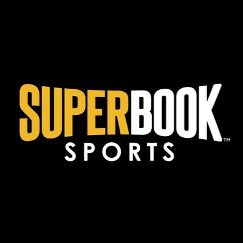 <b>SuperBook</b> 
       <a href="https://co.superbook.com/info/promotions">Deposit match up to $500</a></td>
    <td align = "Left">
      <ol style = "padding-left:10px">
        <li>Sign up for Superbook <a href="https://co.superbook.com/sports"><u>here</u></a> and make your first deposit of $500</li>
        <li>Superbook will match your deposit dollar for dollar up to $500 in bet credits</li>
        <li>Bonus vouchers are applied to 50% of your bet, and expire in 14 days</li>
      </ol>
    </td>
    <td align = "Left">
      <ul style = "padding-left:10px">
        <li>Note bonus voucher value does not get credited back to your account as cash, only the winnings</li>
        <li>Find a friend and take opposite sides of 4 $250 bets with a half-point (e.g. -5.5) spread at -110 odds on each side to <b>guarantee $205</b> each</li>
        <li>$205 + $500 deposit back = ($1,000 total deposit - ($500 cash & $500 credits) lost betting + (($500 cash+$500 credit)*100/110 = $910 bet winnings)) / 2 (each bettor)</li>
      </ul>
    </td>
  </tr>                
        
  <tr valign = "Middle"> 
    <td align = "Center"> <b>Maverick Sports</b> 
       <a href="https://www.playmavericksports.com/info/promotions">$300 Deposit Match + $300 Risk-Free Bet</a> 
      <i>Until Mar. 31st, 2022</i></td>
    <td align = "Left">
      <ol style = "padding-left:10px">
        <li>Sign up for Maverick Sports <a href="https://www.playmavericksports.com/account/joinUs"><u>here</u></a> and make your first deposit of $300</li>
        <li>$300 bonus voucher will be credited in 24 hours</li>
        <li>First bet will also be credited back if lost, up to $300</li>
      </ol>
    </td>
    <td align = "Left">
      <ul style = "padding-left:10px">
        <li>Follow strategy #3 in section below to maximize guaranteed winnigs (<b>$190 guaranteed</b>)</li>
        <li>Free bets staked are not credited back as cash, only the winnings</li>
        <li>Free bets expire in 14 days</li>
      </ul>
    </td>
  </tr>    

  <tr valign = "Middle">
    <td align = "Center">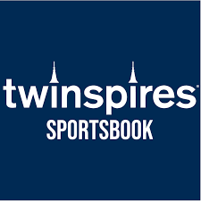 <b>Twinspires Sportsbook</b> 
       <a href="https://co.twinspires.com/promotions.inner.shtml?promo=risk-free-first-sports-bet-1000">Risk free bet up to $1,000</a> 
      <i>Until Feb. 13th, 2022</i></td>
    <td align = "Left">
      <ol style = "padding-left:10px">
        <li>Sign up for Twinspires <a href="https://co.twinspires.com/churchillRegistration.do?bonusCode=FREE1000"><u>here</u></a> using bonus code FREE1000 and make your first deposit of $1,000</li>
        <li>Make your first bet of $1,000, ensuring the bet will settle within 7 days</li>
        <li>If your bet loses, you will be refunded the staked amount, up to $1,000.</li>
        <li>Redeem your free bet within 7 days or it will expire</li>
      </ol>
    </td>
    <td align = "Left">
      <ul style = "padding-left:10px">
        <li>Twinspires does not award bonus funds staked if free bets are won. Use strategy #2 in below section to <b>guarantee $173</b></li>
      </ul>
    </td>
  </tr>              
    
  <tr valign = "Middle">
    <td align = "Center">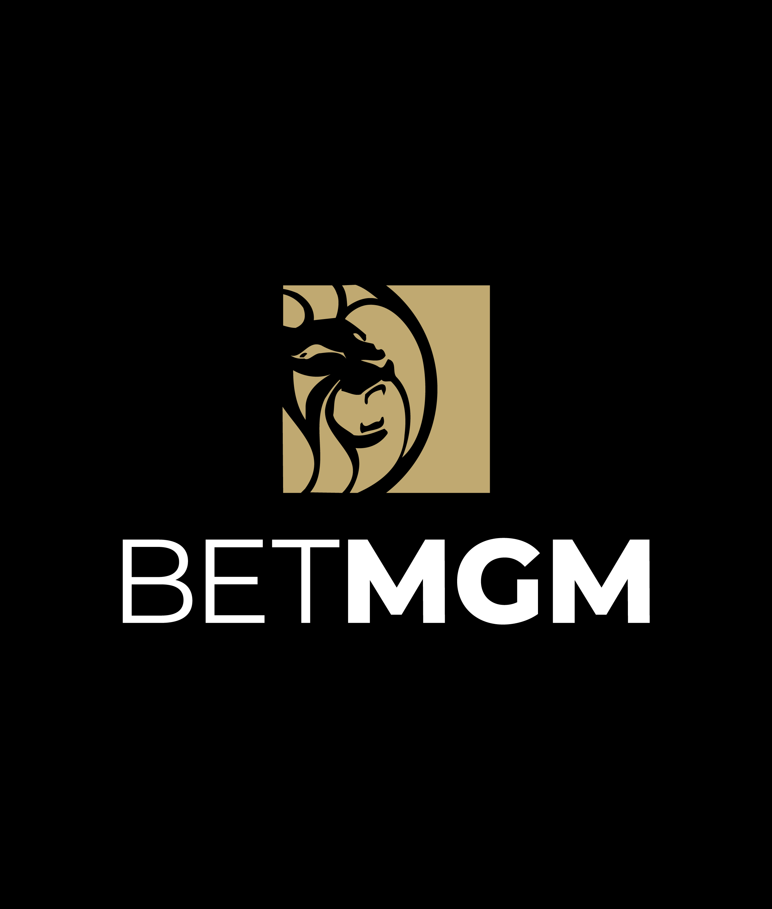 <b>BetMGM</b> 
       <a href="https://promo.co.betmgm.com/en/promo/sports/risk-free?pid=SearchSportsBrand&af_sub1=7060935&wm=7060935&tdpeh=TMI&utm_source=PPC&utm_medium=Sports&utm_campaign=TMI_BetMGM_CO_Brand+Core_BMM&gclid=CjwKCAiArOqOBhBmEiwAsgeLmRkaOwem6UbMtNdoup_yJa_c9c8jOPCo0uDzssItT_aoykrUXsJTnxoCvhkQAvD_BwE&gclsrc=aw.ds">$1,000 "Risk Free" Bet</a> 
      <i>Until Dec. 31st, 2022</i></td>
    <td align = "Left">
      <ol style = "padding-left:10px">
        <li>Sign up for a new BetMGM account <a href="https://www.co.betmgm.com/en/mobileportal/register?productId=BETTING"><u>here</u></a></li>
        <li>Deposit funds and place your first wager up to $1,000</li>
        <li>If you lose your bet, you will receive free bets of the same value up to $,1000</li>
      </ol>
    </td>
    <td align = "Left">
      <ul style = "padding-left:10px">
        <li>On BetMGM, when "free bets" are won, you receive the winnings, but not the staked "free bet". Use straetgy #2 in section below (<b>$170 guaranteed</b>)</li>
        <li>Note a $1,000 bet will be credited with 5 $200 bets, so use strategy #2 in section below, but adjust bet #2 values for $200 and repeat 5 times</li>
        <li>If you do not want the $1,000 risk free bet (not recommended), you can sign-up via <a href="https://www.co.betmgm.com/en/mobileportal/invitefriendssignup?invID=195652"><u>this link</u></a> for a $50 free bet</li>
      </ul>
    </td>
  </tr>    
    
  <tr valign = "Middle">
    <td align = "Center"> <b>Pointsbet</b> 
       <a href="https://join.pointsbet.com/2riskfree/">$2,000 in "Risk Free" bets</a></td>
    <td align = "Left">
      <ol style = "padding-left:10px">
        <li>Sign up for Pointsbet <a href="https://co.pointsbet.com/signup"><u>here</u></a> using promo code WELCOME</li>
        <li>Place your first fixed odds bet up to $500, and receive a refund in free bets if your bet loses</li>
        <li>Additionally, place your funst PointsBetting wager and receive up to a $1,500 refund in free bets if you lose</li>
      </ol>
    </td>
    <td align = "Left">
      <ul style = "padding-left:10px">
        <li>Similar to Caesars, the $500 fixed odds free bet credit does not credit back the free bet stake. Use strategy #2 in section below, adjusting numbers for $500 vs. $1,000 (<b>$85 guaranteed</b>)</li>
        <li>With PointsBetting, if you win your bet by 2 points, you win 2*(bet amount); if you lose by 2 points, you lose 2*(bet amount). There is some risk here. Do not bet the full $1,500 becuase if you lose by more than 1 point, you will not be refunded the full loss.Follow strategy #2 with a smaller stake amount (depending on your appetite for risk)</li>
        <li>If you do not want to use this promo, you can also sign up using <a href="https://co.pointsbet.com/invite/1689871336"><u>this link</u></a> to receive a $100 free bet. Note cannot use the risk-free bet promo in this scenario.</li>
      </ul>
    </td>
  </tr>
    
  <tr valign = "Middle">
    <td align = "Center">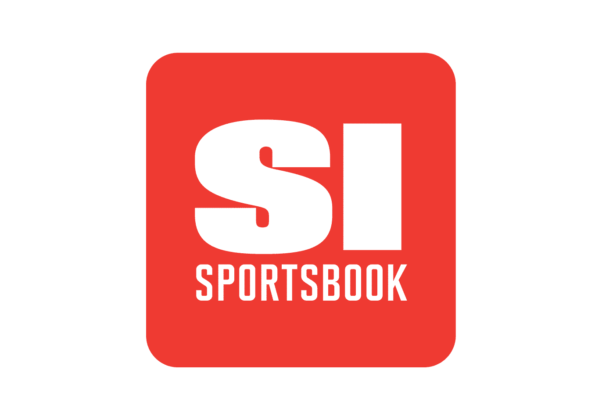 <b>SI Sportsbook</b> 
       <a href="https://www.sisportsbook.com/promotions/">$300 in free bets</a></td>
    <td align = "Left">
      <ol style = "padding-left:10px">
        <li>Sign up for SI Sportsbook <a href="https://www.sisportsbook.com/"><u>here</u></a> and make your first deposit using promo code SI300</li>
        <li>Within 7 days, place a bet of $10 or more with odds of -200 or higher</li>
        <li>receive 6 $50 free bet tokens</li>
      </ol>
    </td>
    <td align = "Left">
      <ul style = "padding-left:10px">
        <li>Free bet tokens do not get awarded back into your account. Find a buddy and bet opposite sides of 6 bets with -110 odds to <b>guarantee $140</b> each</li>
        <li>Free bet tokens expire in 14 days</li>
      </ul>
    </td>
  </tr>    
    
        
  <tr valign = "Middle">
    <td align = "Center">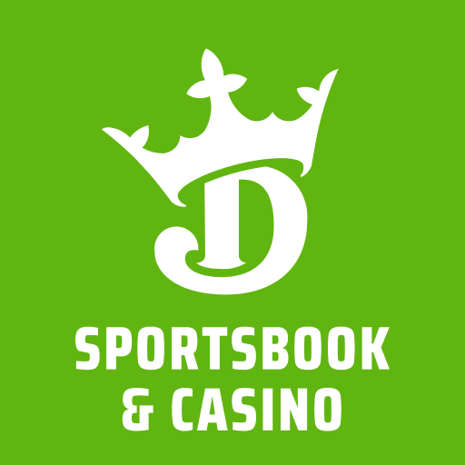 <b>Draftkings</b> 
       <a href="https://sportsbook.draftkings.com/1000-deposit-bonus?wpsrc=Organic%20Search&wpaffn=Google&wpkw=https%3A%2F%2Fsportsbook.draftkings.com%2F1000-deposit-bonus&wpcn=1000-deposit-bonus">20% Deposit Bonus up to $1,000</a> 
      <i>Until Feb. 27th, 2022</i></td>
    <td align = "Left">
      <ol style = "padding-left:10px">
        <li>Sign up for a new Draftkings Sportsbook account <a href="https://sportsbook.draftkings.com/r/sb/cmanzoni/US-CO-SB"><u>here</u></a></li>
        <li>Make your first deposit, and Draftkings will match 20% of the amount in bonus funds, up to $1,000</li>
        <li>$1 in bonus funds will be released for every $25 in bets placed</li>
      </ol>
    </td>
    <td align = "Left">
      <ul style = "padding-left:10px">
        <li>Sign up with <a href="https://sportsbook.draftkings.com/r/sb/cmanzoni/US-CO-SB"><u>this link</u></a> to receive an extra $100</li>
        <li>This bonus seems attractive at first, but to claim the full $1,000 you actually need to bet through $25,000</li>
        <li>Note play-through requirement ($25k) must be met within 90 days</li>
      </ul>
    </td>
    </tr>
  </tbody>
</table>

### How To Guarantee Yourself Winnings From Risk Free Bets
There are ways to guarantee yourself that you will net a positive return with the sign-up bonuses highlighted below.  here are the details on how to do so.

#### Strategy 1: For books that award "Free Bet" stake when "Free Bets" are won
**$1,000 Risk Free Bet = $410 return** 
**Applies to:** Fanduel Sportsbook, Barstool Sportsbook

<ol>
  <li>Find a buddy who is also eligible to receive a risk free bet</li>
  <li>Sign up using the instructions & links provided in the section below and deposit funds to receive your risk free bet promo</li>
  <li>Find an event that has a half point spread (e.g. -5.5 and +5.5) and even odds on both sides of the line (usually -110 on each side is the best you will see)</li>
  <ol>
    <li><i>The half point spread ensures there is no possibility of a tie</i></li>
  </ol>
  <li>You & your buddy each bet on opposite sides of this line (e.g. you bet Home team to cover -5.5 and your friend bets Away team to cover +5.5, both at -110 odds). This way, you guarantee one of you will win and one of you will lose</li>
  <ol>
    <li><i>At -110, a $1,000 bet will net the winner $910, so if you win you will have $1,910 and your friend will have a $1,000 free bet credit for a subsequent bet</i></li>
  </ol>
  <li><i>Make sure to place these bets at the same time, to reduce any risk that the line or the odds change</i></li>
  <li>Repeat steps 3 & 4 for the same amount</li>
  <ol>
    <li>If you win, you will now have $1,910 + $910 = $2,820 and your friend will have $0. Split the total so you each receive $1,410.</li>
    <li>If you lose, you will now have $910 and your friend will have $1,910, for a total of $2,820.  Split the total so you each receive $1,410.</li>
    <li>After accounting for the $1,000 initially deposited, you each net $410</li>
  </ol>
</ol> 

Refer to the below table for each pososible scenario and outcome if the above steps are followed
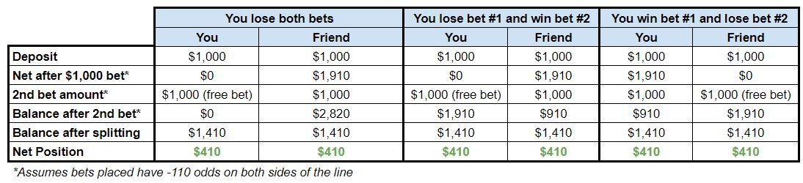

#### Strategy 2: For books that do not award "Free Bet" stake when "Free Bets" are won
**$1,000 Risk Free Bet = $170 return** 
**Applies to:** Caesars, Twinspires, Pointsbet, BetMGM

<ol>
  <li>Find a buddy who is also eligible to receive a risk free bet</li>
  <li>Sign up using the instructions & links in the section below and deposit funds to receive your risk free bet promo</li>
  <li>Find an event that has a half point spread (e.g. -5.5 and +5.5) and even odds on both sides of the line (usually -110 on each side is the best you will see)</li>
  <ol>
    <li><i>The half point spread ensures there is no possibility of a tie</i></li>
  </ol>
  <li>You & your buddy each bet on opposite sides of this line (e.g. you bet Home team to cover -5.5 and your friend bets Away team to cover +5.5, both at -110 odds). This way, you guarantee one of you will win and one of you will lose</li>
  <ol>
    <li><i>At -110, a $1,000 bet will net the winner $910, so if you win you will have $1,910 and your friend will have a $1,000 free bet credit for a subsequent bet</i></li>
  </ol>
  <li>Repeat steps 3 & 4, however under these promotion terms, whoever won the first bet will need to alter the bet amount of the second bet. The
losing player will still bet the full free credit bet of $1,000.</li>
  <ol>
    <li>If your friend has a $1,000 free bet credit, then the total <i>winnings</i> they could be awarded is only $910, as the free bet staked will not be awarded back as well</li>
    <li>If you won the first bet, then the second bet placed should only be $475. <i>Assumes odds of -110 on each side. If odds are different, this bet amount will differ</i></li>
    <ol>
      <li>If you win, you will now have $1,910 + $431(your winnings) = $2,341 and your friend will have $0. Split the total so you each receive $1,170</li>
      <li>If you lose, you will now have $1,910 - $475 = $1,435 and your friend will have $910 (since the $1,000 free bet is not credited back), for a total of $2,345.  Split the total so you each receive $1,172</li>
    </ol>
  </ol>
  <li>After accounting for the $1,000 initially deposited, you each net ~$170</li>
</ol>

Refer to the below table for each pososible scenario and outcome if the above steps are followed
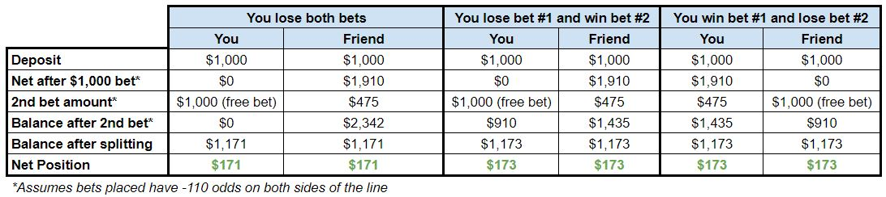

#### Strategy 3: Specific for Mavercik Sports (Deposit match + free bet promo)
**$300 deposit match + $300 risk-free bet = $185 return** 
**Applies to:** Maverick Sports
Strategy is basically the same as strategy #2 above, just with different bet amounts for bet #1 and Bet #2. 
<ul>
  <li>The first bet placed is $600, which is equal to $300 of your cash deposit, plus the $300 deposit match</li>
  <li>The winner of the first bet will receive the $300 cash stake, plus winnings from a $600 bet (the $300 deposit matched does not get credited back to your account)</li>
  <li>Again, because the free bet credit is not awarded back if a bet is won (only the winnings are credited back), the winner of the first bet should only stake $140. The loser of the first bet will still stake the full $300 free bet</li>

Refer to the table below 
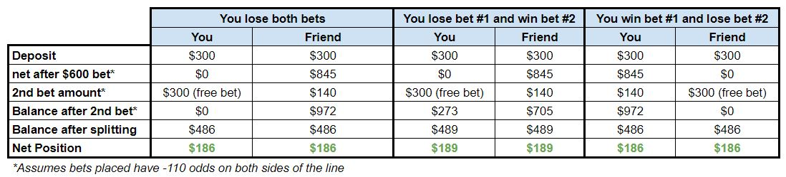

### Keep The Earnings Going: Sportsbook Reviews and Rankings

